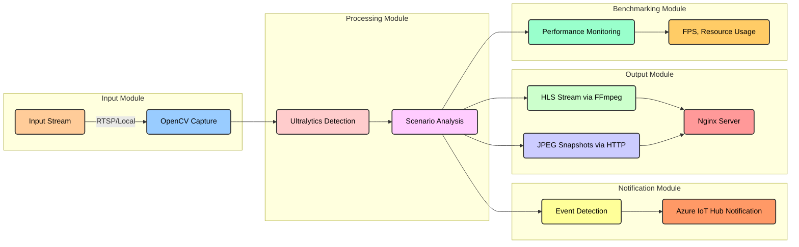

# Application Architecture

FVG Vision AI is structured into a modular architecture designed to facilitate flexibility, scalability, and ease of
configuration. Each module handles a specific task within the application, allowing for clear separation of concerns and
easy customization.

The main components of the architecture are as follows:

1. **Input Module**  
   The Input module is responsible for capturing video streams. The system supports video input from both local
   sources (e.g., video files) and network streams via RTSP. The video feed is handled using OpenCV.

2. **Processing Module**  
   The Processing module is the core of the application. It performs object detection and scenario-specific analytics
   using the Ultralytics library. The module can process various real-time analytics scenarios, such as people counting,
   parking space monitoring, and hand-raise detection.

3. **Notification Module**  
   The Notification module connects to external services, such as Azure IoT Hub, to send real-time alerts based on
   events detected during video analysis. Notifications are triggered by configurable thresholds or conditions.

4. **Output Module**  
   The Output module is responsible for delivering the processed video stream or snapshots. It supports two main output
   formats:
    - **HLS (HTTP Live Streaming)** for continuous video streaming.
    - **JPEG** snapshots delivered via HTTP.  
      The output is served using an Nginx server integrated within the Docker container.

5. **Configuration and Control**  
   The application allows configuration through multiple methods, including default configuration files, environment
   variables, and command-line arguments. The configuration can be customized for both input sources and processing
   scenarios.

6. **Benchmarking Module**  
   The Benchmarking module is a specialized component used to evaluate the system's performance. It provides metrics
   such as FPS (frames per second) and resource usage, which are useful for optimizing the application for different
   hardware environments.

Below is a visual representation of FVG Vision AI's architecture:

The same diagram as image:

{ thumbnail="true" }
