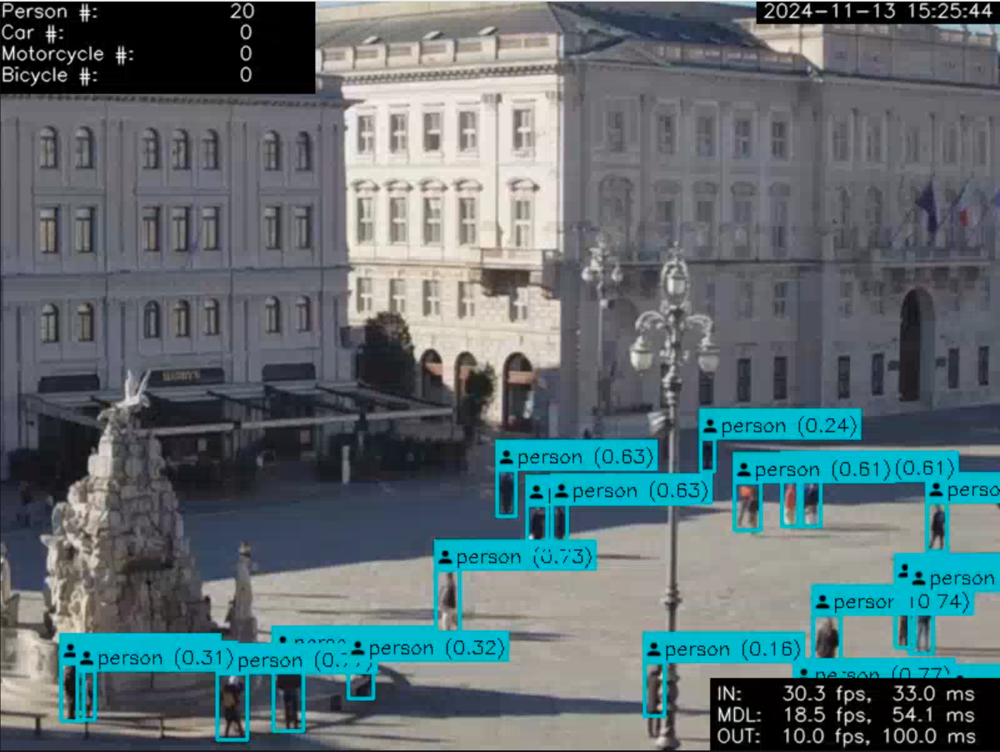

# Quick start

To quickly run the application inside a Docker container, follow the steps below for your platform.

## On Jetson AGX/Orin platform, WITH cuda acceleration

- Open a bash shell in the `docker/jetson-agx-jp6` directory.
- Run `setup.sh` to configure the appropriate user permissions and CUDA paths.
- Execute `./docker_start_main.sh` to start the containerized application.

## On PC platform, WITH cuda acceleration

- Open a bash shell in the `docker/amd64-cuda` directory.
- Run `setup.sh` to configure the appropriate user permissions and CUDA paths.
- Execute `./docker_start_main.sh` to launch the container.

## On PC platform without cuda acceleration

To run the application without CUDA support, use the following Docker command:

```bash
docker run -d                                                         \
        --shm-size=5gb                                                \
        -p 5000:5000 -p 80:8080                                       \
  	    --mount type=tmpfs,destination=/mnt/hls                       \
	    --name fvgvision-ai xcesco/fvgvision-ai:0.2.0-amd64-main
```

Alternatively, you can open a bash shell in the `docker/amd64` directory and execute `./docker_start_main.sh`.

## Verifying the Application

Once started, the application will run with a default configuration. To verify the setup:

- Open a browser and navigate to http://localhost.
- If the setup is successful, you should see a live video feed similar to the following:



## Configuring Application Behavior

Once you've confirmed the application is running correctly, you can customize its behavior by adjusting the various
configuration parameters. For details on available settings and how to modify them, please refer to the dedicated
[settings section](Settings.md) in the documentation.


